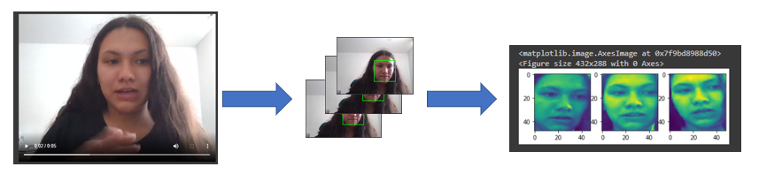
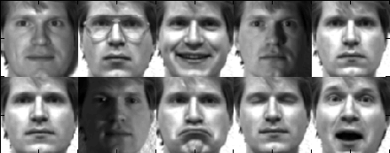
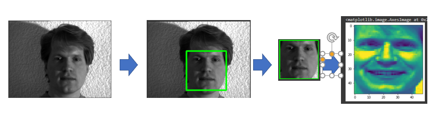
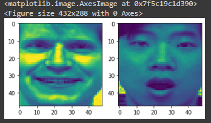
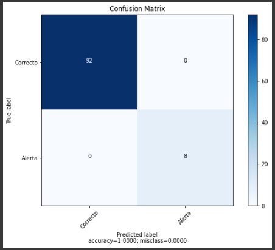
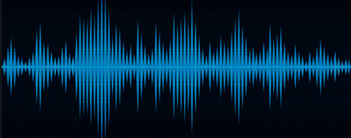
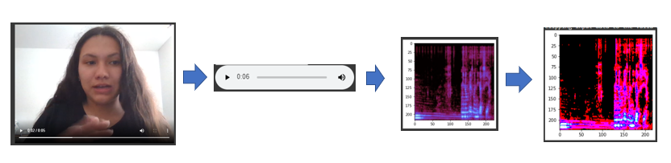
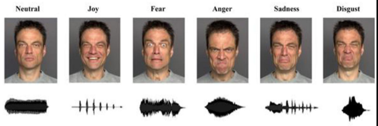
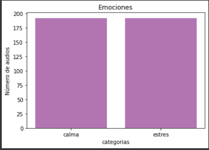
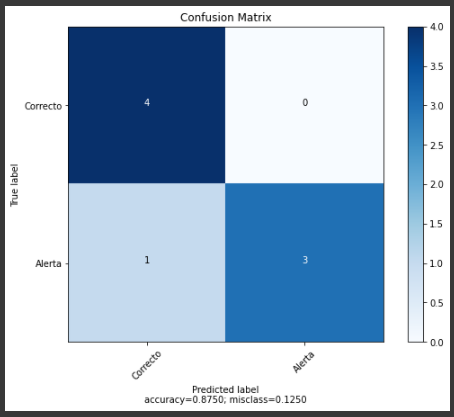

# Validación de identidad
El objetivo de este repositorio es generar dos estrategias de validación de identidad para una persona: reconocimiento facial y estrés de voz.

Para la validación, usando la cámara y micrófono del dispositivo en uso se pedirá a la persona responder ciertas preguntas acerca de su identidad, adicional a ello se pedirá una fotografía del documento original de identidad de la persona donde se encuentre una fotografía.

## Reconocimiento facial
Para el reconocimiento facial se requieren dos inputs: Foto de un documento de identidad donde se vea el rostro, video de su rostro tomado en el momento de hacer la validación.
Durante la toma del video se pide a la responder ciertas preguntas frente a la camára, del video resultante se extraen 3 frames los cuales serán comparados con la fotografia de rostro reconocida en el documento de identidad se valida la coincidencia en las imágenes.

## Estrés de voz

Con la intención de determinar cuando una persona podría estar mintiendo se analiza el audio recogido en el video inicial donde la persona responde preguntas acerca de su identidad, (Ej. se pide decir viendo a la camara yo soy.. con .... años de edad, mi fecha de nacimiento es ..... vivo en la ciudad de...), este audio será sometido a una prueba de estres de voz donde se determina el estres en la voz al responder las preguntas. Con eso se puede asumir que una voz estresada o en otras palabras nerviosa  puede relacionarse con el acto de mentir.

# Contenido

#### [Procesamiento y modelamiento de datos](#Procesamiento-y-modelamiento-de-datos)

1. [Datos de video](#Datos-de-video)
    1. [Pre-procesamiento de imagen](#Pre-procesamiento-de-imagen)
    2. [Construcción del conjunto de datos](#Construcción-del-conjunto-de-datos) 
    3. [Modelo de validación de identidad con imagenes](#Modelo-de-validación-de-identidad-con-imagenes)
2. [Datos de Audio](#Datos-de-Audio)
    1. [Preprocesamiento del audio (Audio a espectograma)](#Preprocesamiento-del-audio-(Audio-a-espectograma))
    2. [Construcción del conjunto de datos](#Construcción-del-conjunto-de-datos)
    3. [Modelo estrés de voz](#Modelo-estrés-de-voz)

# Procesamiento y modelamiento de datos
## Datos de video
###  Pre-procesamiento de imagen
El proyecto tendrá como objetivo la identificacion de rostro. 
Para esto se usará una red pre-entrenada ([dlib face recognition](http://dlib.net/)) que es capaz de reconocer el area del rostro posando de manera frontal.

#### Propuesta de pre-procesamiento del dato

El objetivo es conectar el programa a la camará de algún dispositivo a disposición del usuario y tomar un video:

1. Del video se extraerán imagenes
2. De cada imagen se identificará el rostro eliminando información no util, por ejemplo, el fondo, las orejas, cabello y cuello.
3. Se pone en escala de grises
4. Se redimensionan las imagenes

#### Construcción del conjunto de datos

Para el entrenamiento de reconocimiento de rostro se usará como base el conjunto de datos [YALE FACE DATABASE](http://vision.ucsd.edu/content/yale-face-database) donde se tiene el rostro de  15 personas con 11 fotos por persona,una por cada expresión o configuración facial diferente: 
1. luz central
2. Con lentes
3. Feliz
4. Luz izquierda
5. Sin lentes
6. Normal
7. Luz derecha
8. Triste
9. Somnoliento
10. Sorprendido
11. Guiño

El objetivo es combinar por pares de fotografias, esta tarea se dicide en dos partes:
1. preprocesar las imagenes obteniendo de ellas solo el rostro y convertirlas en tensor.

2. Cada posible pareja de imagenes se almacena en un solo tensor, es decir, el tensor resultante tendrá 2 canales, en cada canal un rostro.

3. Se asigna el target a cada parreja de rostros, si los rostros pertencen a la misma persona, el target será 1, de lo contrario será 0.

#### Modelo de validación de identidad con imagenes

El enfoque seleccionado para la identificación de identidad es la incrustación, para esto se realiza una transferencia de conocmiento del modelo preentrenado para reconocimiento facial (para este caso **VGGFace** y **VGG19** ), se omite la última capa densa del modelo y se realizan las predicciones (incrustación) para los datos de imagen preprocesados, es decir, se utiliza toda la red pre-entreada a excepción de la capa de salida para obtener una representación en forma de vector que resuma las característics de las imágenes. Finalmente, cada imagen es representada en un espacio d-dimensional lo cual facilita el uso de métricas de similitud como se presenta acontinuación:

* La arquitectura del modeloe VGGFace puede ser consultada en el siguiente link [VGGFace]('https://gist.github.com/EncodeTS/6bbe8cb8bebad7a672f0d872561782d9')
* La arquitectura del modeloe VGG19 puede ser consultada en el siguiente link [VGG19]('https://github.com/fchollet/deep-learning-models/blob/master/vgg19.py')

####  Calculo de diferencias

Una vez se obtienen las incrustaciones de la imagen captuarada por la cámara de la aplicación y de la foto enviada por el usuario de su cedula, se establece la similitud entre las caras presentes en ambas fotos, para lo cual se utiliza 1 - la distancia coseno, se dice que las fotos corresponden a la misma persona si su similitud es mayor a 0.5 caso contrario se generará una alerta de posible fraude.

#### Evaluación predicción 

La evaluación del desempeño del algorítmo se realiza con base en la matriz de confusión. En este caso se obtuvo una presición de 1.

## Datos de Audio

Los datos de audio serán extraidos del video que se proporcione inicialmente.

### Preprocesamiento del audio (Audio a espectograma)

Los audios se trabajarán en forma de espectogramas para posteriormente ingresar a un modelo entrenado basado en convoluciones, por esta razón se extrae el audio desde el el video grabado por el dispositivo a disposición del usuario, se guarda como un archivo .wav y con ayuda de la librería *librosa* se convierte en un spectograma en formato \*.jpg que luego será leido cómo un tensor y servirá como input del modelo de clasificación de estrés de voz.

### Construcción del conjunto de datos

Con el objetivo de identificar el estres en la voz,se toman como ejemplo datos de audio de la base [RAVDESS](https://zenodo.org/record/1188976#.XsyEAmhKhPY). La cual tiene dos tipos de archivos:

Audio: Habla y canto 

Video: Habla y canto Cada uno de estos tiene varios identificadores, los cuales son los siguientes:

* Modalidad (01 = full-AV, 02 = video-only, 03 = audio-only).

* Canal de audio (01 = speech, 02 = song).

* Emoción (01 = neutral, 02 = calm, 03 = happy, 04 = sad, 05 = angry, 06 = fearful, 07 = disgust, 08 = surprised).

* Intensidad Emocional (01 = normal, 02 = strong).

* Declaración (01 = "Kids are talking by the door", 02 = "Dogs are sitting by the door").

* Repetición (01 = 1st repetition, 02 = 2nd repetition).

* Actor (01 to 24. Odd numbered actors are male, even numbered actors are female).

Se extraerán solo los archivos de audio, es decir "*.wav", de estos solo tomaremos los datos de tipo "habla" y para simular el estres de voz tomaremos como ejemplo las emociones "Calmado" que representará una voz no estresada y la emoción "asustado" que representará la voz estresada.

**Modalidad**:
* 03= Audio

**Canal**
* 01= Habla

**Emoción**:

*  02=Calmado (Tomará el valor 0: no estres en la voz)
*  06=Asustado (Tomará el valor 1: estres en la voz)

Con esto se obtiene un total de 384 audios donde 192 pertenecen a la categoria de voz no estresada y 192 a la categoria de voz estresada.

### Modelo estrés de voz

Una vez pre-procesados los datos de audio se entrena una red neuronal con modelos pre-entrenados que busca clasificar el input de audio en las categorías de "calma" y "estrés".

#### Detalles del entrenamiento

Se proponen tres diferentes modelos pre entrenados a usar: InceptionV3, MobileNet y VGG19; y se completa la arquitectura de la red:

* Añadiendo 4 capas convolucionales con tamaño de kernel (3, 3) con un número creciente de filtros (16, 32, 32, 64)
* Se añade Maxpooling2D  despues de cada 2 capas convolucionales.
* Activación de LeakyReLU despues de cada convolución.
* Una capa de BatchNormalization luego de la segunda convolución.
*  Dropout después de cada pooling.

Cómo modelo final se tomó la red entrenada con el modelo [MobileNet](https://github.com/keras-team/keras-applications/blob/master/keras_applications/mobilenet.py) como base.

La evaluación del modelo se realizará estudiando la matriz de confusión de las predicciones sobre el conjunto de prueba.

